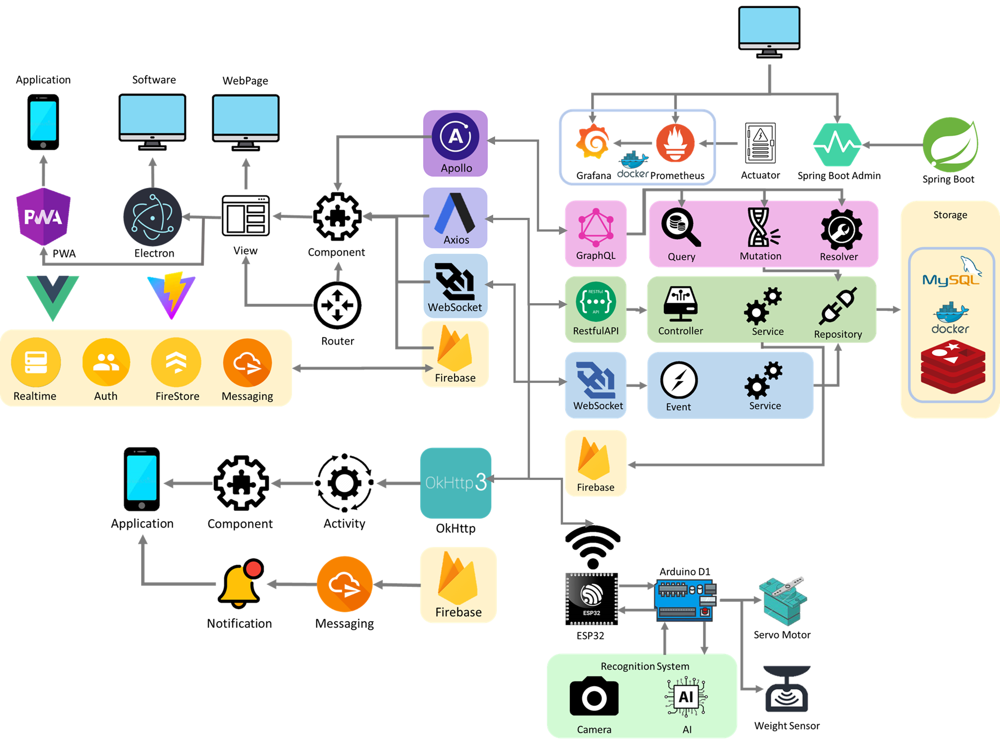

# Garbage Classifier Frontend

### Yuntech Information management department System Analysis and Design G6 Teamwork


Powered By Vue3 and Vite

----

### Structure of Project

> Involve Application Frontend Backend Hardware

[Application Project](https://github.com/lavender0526/Garbage_Classifier_App)

[Frontend Project](https://github.com/fan9704/Garbage_Classifier_Frontend)

[Backend Project](https://github.com/fan9704/Garbage_Classifier_Backend)

[Hardware Project](https://github.com/fan9704/Garbage_Classifier_Hardware)

----

### Software Architecture




----


----

### Install all dependencies

```shell
yarn install
```
### Run project

```shell
yarn dev
```

----

# Vite

This directory is a brief example of a Vite/Vue.js site that can be deployed to Vercel with zero configuration.

While this project uses Vue.js, Vite supports many popular JS frameworks. [See all the supported frameworks](https://vitejs.dev/guide/#scaffolding-your-first-vite-project).

## Deploy Your Own

Deploy your own Vite project with Vercel.

[](https://vercel.com/new/clone?repository-url=https://github.com/vercel/vercel/tree/main/examples/vite&template=vite)

_Live Example: https://vite-vue-template.vercel.app_

### How We Created This Example

To get started with Vue.js deployed with Vercel, you can use Vite (https://vitejs.dev/guide/#scaffolding-your-first-vite-project) to initialize the project:

```shell
$ yarn create @vitejs/app
```

### Deploying From Your Terminal

You can deploy your new Vite project with a single command from your terminal using [Vercel CLI](https://vercel.com/download):

```shell
$ vercel
```
